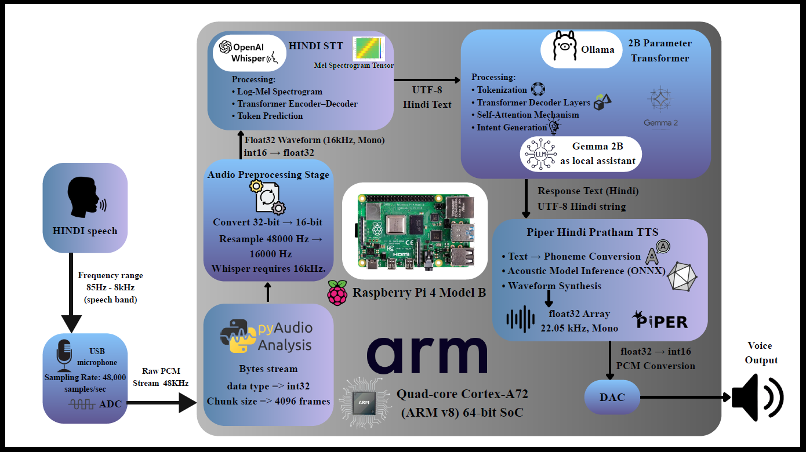

# Offline Hindi Voice Assistant

### Raspberry Pi 4 | Whisper | Gemma 2B | Piper TTS


---

## 📌 Overview

A fully offline, end-to-end **Speech-to-Speech AI Assistant** deployed on **Raspberry Pi 4 (8GB, ARM Cortex-A72)**.

The system performs:

🎙️ **Hindi Speech-to-Text (Whisper)**
🧠 **Local LLM Inference (Gemma 2B)**
🔊 **Text-to-Speech Synthesis (Piper ONNX)**

All processing runs entirely **on-device**, ensuring **privacy, low latency, and zero cloud dependency**.

---

## 🏗️ System Architecture

```
USB Microphone (48 kHz PCM)
        ↓
Resampling → 16 kHz Mono
        ↓
Whisper STT (FP32 Log-Mel Spectrogram)
        ↓
Gemma 2B LLM (2B Parameters, On-device)
        ↓
Piper TTS (ONNX, 22.05 kHz Output)
        ↓
Speaker Output
```

---

## ⚙️ Technical Specifications

| Component      | Details                                 |
| -------------- | --------------------------------------- |
| Hardware       | Raspberry Pi 4 (8GB RAM)                |
| CPU            | Quad-core ARM Cortex-A72 (64-bit)       |
| Input Audio    | 48 kHz PCM                              |
| STT Processing | 16 kHz Mono, 4096-frame streaming       |
| LLM            | Gemma 2B (Transformer, local inference) |
| TTS Output     | 22.05 kHz                               |
| Deployment     | Fully Offline                           |

---

## 🛠️ Installation

### Requirements

* Raspberry Pi 4 (8GB recommended)
* Raspberry Pi OS (64-bit)
* Python 3.9+
* USB Microphone & Speaker

### Setup

```bash
sudo apt update
sudo apt install python3-pip portaudio19-dev
pip install numpy pyaudio whisper onnxruntime ollama
```

Install Piper separately and download a Hindi voice model.
[Piper Hindi TTS](https://huggingface.co/rhasspy/piper-voices/tree/main/hi/hi_IN/pratham)

### Run

```bash
python3 main.py
```


---

## 📊 Performance Highlights

* 48 kHz audio capture
* 16 kHz STT processing
* 2B-parameter Transformer inference
* 22.05 kHz synthesized output
* 100% cloud-independent execution

---

## 🔮 Future Improvements

* INT8 quantization for faster inference
* Wake-word detection
* Edge TPU/NPU acceleration
* Multi-language expansion

---

## 👨‍💻 Author

**S S Jhotheeshwar**
Electronics Engineering (VLSI Design & Technology)
Chennai Institute of Technology


